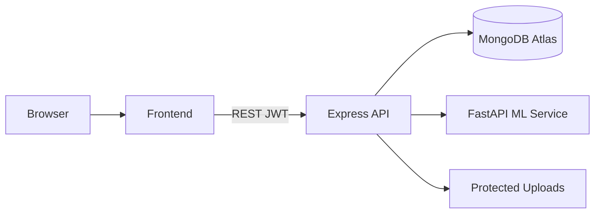

# MediCentral Healthcare Platform

MediCentral is a full-stack healthcare management platform with secure medical records, a **prototype symptom assistant** (rules-based, not a trained clinical model), hospital locator maps, and OCR document scanning.

## Architecture

- **Frontend:** React 19, Vite, Tailwind CSS, Framer Motion, Leaflet
- **Backend:** Node.js, Express 5, MongoDB, JWT auth
- **ML service:** FastAPI + Tesseract OCR + **rules-engine symptom matcher** (honest MVP labeling)



## Demo flow (recommended)

1. Register a **Doctor** and a **Patient** (separate browsers/incognito).
2. Copy the **Patient ID** (`MC-PT-XXXX`) from the patient dashboard.
3. Doctor: search patient ID → create record (optional image + OCR).
4. Patient: refresh dashboard → see timeline.
5. **Symptom Assistant:** select `fever` + `cough` → run analysis.
6. **Hospitals:** allow location → view facilities (auto-seeded when empty).

## Local setup (manual)

### Prerequisites

- Node.js 18+
- MongoDB (local or Atlas)
- Python 3.10+ (for ML service)

### 1. Backend

```bash
cd backend
cp .env.example .env
# Edit .env — set MONGO_URI and JWT_SECRET
npm install
npm run seed    # optional: seed hospitals
npm run dev
```

### 2. ML service

```bash
cd ml-service
python -m venv venv
# Windows: venv\Scripts\activate
pip install -r requirements.txt
uvicorn app:app --reload --port 8000
```

### 3. Frontend

```bash
cd frontend
cp .env.example .env
npm install
npm run dev
```

Open http://localhost:5173 — API defaults to `http://localhost:5000/api`.

## Docker Desktop (recommended)

1. Start **Docker Desktop** and wait until it is running.
2. From the repo root:

```powershell
docker compose up --build
```

Or use the helper script:

```powershell
.\scripts\docker-up.ps1
```

- **Web app:** http://localhost (API proxied at `/api`)
- **API:** http://localhost:5000
- **ML:** http://localhost:8000

See [DOCKER.md](./DOCKER.md) for troubleshooting, reset volumes, and production compose.

Set `SEED_DEMO_DATA=true` on the backend to auto-seed hospitals when the collection is empty.

## Environment variables

| Variable | Service | Description |
|----------|---------|-------------|
| `MONGO_URI` | Backend | MongoDB connection string |
| `JWT_SECRET` | Backend | JWT signing secret |
| `ML_SERVICE_URL` | Backend | FastAPI base URL |
| `CORS_ORIGIN` | Backend | Comma-separated allowed origins |
| `SEED_DEMO_DATA` | Backend | `true` to seed hospitals if empty |
| `SEED_SECRET` | Backend | Required header for manual reseed |
| `VITE_API_URL` | Frontend | API base URL (build-time) |

## Security notes

- Medical uploads are served via **authenticated** `/api/uploads/:filename` (not public static).
- Registration is limited to **patient** and **doctor** roles.
- Hospital reseed requires JWT + `x-seed-secret` header.
- Symptom assistant output includes a **medical disclaimer** — not for diagnosis.

## Production launch (Final Phase)

MediCentral is packaged for **deployable, investor-ready** demos.

### One-command demo seed

```bash
cd backend
npm run seed:launch    # foundation + demo + presentation scenarios
npm run dev
```

### QA smoke (API running)

```bash
cd backend
npm run qa:smoke
```

### Demo accounts (password `demo123`)

| Email | Role |
|-------|------|
| patient@demo.com | Patient |
| doctor@demo.com | Doctor |
| staff@demo.com | Reception / hospital ops |
| superadmin@demo.com | Command Center |

**Investor walkthrough:** [docs/launch/DEMO-WALKTHROUGH.md](docs/launch/DEMO-WALKTHROUGH.md)  
**Full documentation index:** [docs/launch/INDEX.md](docs/launch/INDEX.md)  
**Launch report:** [docs/launch/FINAL-PHASE-REPORT.md](docs/launch/FINAL-PHASE-REPORT.md)

## Deployment

| Component | Suggested host | Config |
|-----------|----------------|--------|
| Frontend | Vercel / Cloudflare Pages | `vercel.json`, `VITE_API_URL` |
| Backend | Render / Railway | `render.yaml`, `.env.production.example` |
| ML | Render Docker | Tesseract required |
| Database | MongoDB Atlas | `MONGO_URI` |
| Self-hosted | Docker | `docker-compose.prod.yml` |

Copy `.env.production.example` → `backend/.env` and `frontend/.env.production.example` → `frontend/.env` before production builds.

## License

Educational / demonstration project.
