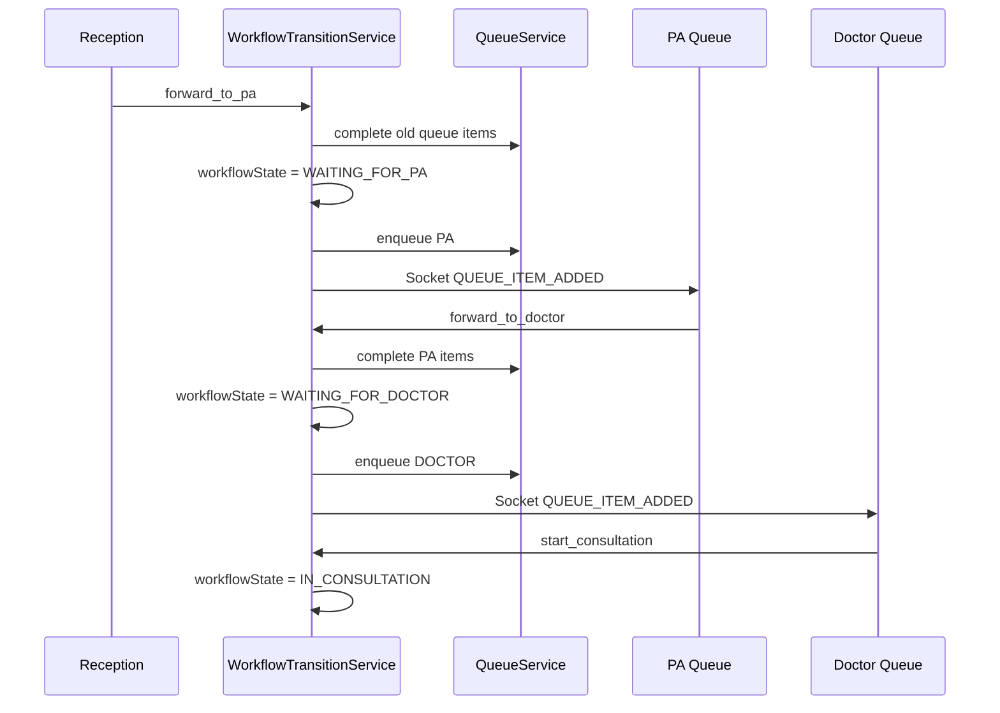

# Phase 1 — Workflow Transitions + Reception → PA → Doctor

## 1. Workflow transition architecture

**Service:** `backend/modules/workflows/workflow-transition.service.js`

| Step | Responsibility |
|------|----------------|
| Validate | `WorkflowEngine.canTransition(from, to, operationalRole)` |
| Complete queues | `QueueService.completeQueuesForVisit(visitId)` |
| Update visit | `workflowState`, `currentQueueType`, legacy `status`, vitals/notes |
| Enqueue next | `QueueService.enqueueForVisit()` for target department |
| Timeline | `TimelineService.appendEvent(type: workflow)` |
| Notify | `notifyWorkflowTransition` + `notifyPatientForwarded` (Socket-ready) |
| Audit | `logActivity` when `req` present |

**API:**

- `GET /api/workflow/visit/:visitId` — available actions
- `POST /api/workflow/visit/:visitId/transition` — body: `{ action }` or `{ toState }`

## 2. Queue forwarding flow



No manual patient ID re-entry — all actions use `visitId` from queue cards.

## 3. Reception → PA → Doctor flow

| Stage | State | Queue | Role |
|-------|-------|-------|------|
| Visit created | `REGISTERED` | RECEPTION | receptionist |
| Forward to prep | `WAITING_FOR_PA` | PA | receptionist |
| Start prep | `PA_REVIEW` | PA | doctor_pa |
| Ready for doctor | `WAITING_FOR_DOCTOR` | DOCTOR | doctor_pa |
| Consultation | `IN_CONSULTATION` | DOCTOR | doctor |

## 4. New APIs

| Method | Path | Purpose |
|--------|------|---------|
| GET | `/api/ops/context` | Staff tenant/branch/role |
| GET | `/api/ops/patients/search?q=` | Quick search |
| POST | `/api/ops/reception/quick-visit` | Minimal visit + auto-forward PA |
| GET | `/api/ops/visit/:id/patient-card` | Smart card + documents |
| PATCH | `/api/ops/visit/:id/prep` | PA/doctor notes, vitals |
| POST | `/api/ops/visit/:id/documents` | PA upload |
| GET | `/api/ops/doctor/visit/:id` | Doctor context |
| GET | `/api/queues/metrics` | Live counters |
| GET | `/api/queues/:queueType` | RECEPTION, PA, DOCTOR |
| GET | `/api/workflow/visit/:id` | Available actions |
| POST | `/api/workflow/visit/:id/transition` | Execute transition |

## 5. Queue events (Socket-ready)

| Event | When |
|-------|------|
| `workflow:updated` | Any transition |
| `queue:item:added` | Patient forwarded to new queue |
| `queue:item:updated` | Queue item refresh |
| `emergency:alert` | Critical priority visit |

## 6. Timeline events (Phase 1)

| Title | Trigger |
|-------|---------|
| Visit created at reception | `quick-visit` |
| Forwarded to PA preparation | `forward_to_pa` |
| PA preparation started | `start_pa_review` |
| Ready for doctor consultation | `forward_to_doctor` |
| Consultation started | `start_consultation` |
| PA preparation notes updated | PATCH prep |
| Report uploaded — * | PA document upload |
| Prescription — * | Doctor prescription save |
| Lab ordered / Sent to billing | Placeholder transitions |

## 7. Updated architecture map

Legacy `/api/*` unchanged. Operational layer:

```
/api/ops      → reception + PA + doctor context
/api/queues   → live queue lists + metrics
/api/workflow → transitions
```

Frontend routes:

- `/dashboard` → `OpsDashboardRouter` (role-based)
- `/ops/reception`, `/ops/pa`, `/ops/doctor`
- `/hospital-ops` → legacy ERP (preserved)

## 8. Screens implemented

| Screen | Path | User |
|--------|------|------|
| Reception Control | `/ops/reception`, default staff dashboard | receptionist |
| PA Preparation | `/ops/pa` | doctor_pa |
| Doctor Consultation Queue | `/ops/doctor`, doctor login | doctor |
| Legacy Hospital ERP | `/hospital-ops` | admin / unassigned staff |
| Patient dashboard | unchanged | patient |

## 9. Reused modules

- Auth JWT, `Patient`, `HospitalVisit` (extended)
- `PrescriptionForm`, `TreatmentTimeline`
- `uploadMiddleware`, `PatientDocument`
- `patientController` search patterns
- Phase 0 `TenantService`, `WorkflowEngine`, `TimelineService`

## 10. Technical debt remaining

- Lab/billing transitions are placeholders (state changes only)
- OCR on PA dashboard deferred to Phase 2
- Legacy `HospitalDashboard` still parallel to ops flow
- Doctor global patient read not fully restricted
- Quick-register creates synthetic email patients
- Queue refresh is polling (no Socket UI yet)
- `TimelineEvent` + legacy aggregator not merged in GET timeline

## 11. Phase 2 recommendations

1. Lab queue dashboard + real `LAB_*` transitions  
2. Billing queue + invoice link to visit  
3. Socket.IO client subscription in queue dashboards  
4. Consent / cross-hospital (Apollo ↔ Yashoda)  
5. Remove upload/OCR from any doctor-facing legacy page  
6. Auto-refresh queues every 15s or websocket  

## Demo accounts

| Email | Password | Role | Dashboard |
|-------|----------|------|-----------|
| staff@demo.com | demo123 | receptionist | Reception |
| pa@demo.com | demo123 | doctor_pa | PA (run `npm run seed:foundation`) |
| doctor@demo.com | demo123 | doctor | Doctor queue |
| patient@demo.com | demo123 | patient | Patient (MC-PT-1001) |

## Demo script

1. Login **staff@demo.com** → search `MC-PT-1001` → Create & forward to PA  
2. Login **pa@demo.com** → PA queue → select patient → upload note → Forward to doctor  
3. Login **doctor@demo.com** → Doctor queue → Start consult → Prescription → Timeline updates  

Ensure `SEED_FOUNDATION=true` and `npm run seed:foundation`.
