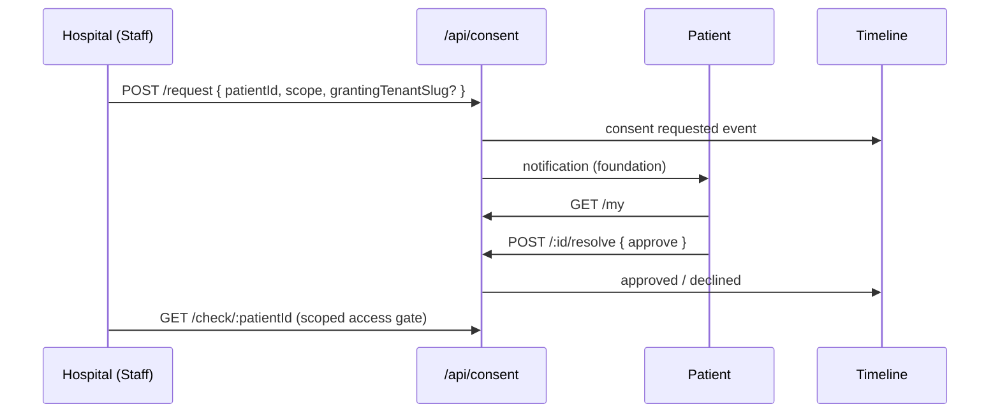

# Phase 2 — Lab + Billing + Realtime + Interoperability Foundation

## Success condition

A patient can flow **Reception → PA → Doctor → Lab → Billing** with automatic queue forwarding, timeline provenance, live Socket.IO updates, and auto-aggregated billing — without re-entering patient data or giant CRUD forms.

---

## 1. Lab workflow architecture

**States:** `IN_CONSULTATION` → `LAB_REQUIRED` → `LAB_PENDING` → `LAB_COMPLETED` → `BILLING_PENDING`

| Action | From | To | Role |
|--------|------|-----|------|
| `order_lab` | `IN_CONSULTATION` | `LAB_REQUIRED` | doctor |
| `start_lab` | `LAB_REQUIRED` | `LAB_PENDING` | lab_supervisor |
| `complete_lab` | `LAB_PENDING` | `LAB_COMPLETED` | lab_supervisor |
| `forward_to_billing` | `LAB_COMPLETED` | `BILLING_PENDING` | lab / billing (auto-chained after complete) |

**Services:**

- `WorkflowTransitionService` — transitions, `visit.labOrders[]`, lab instructions, queue enqueue
- `LabOpsService` — visit context, report upload, vitals on complete
- `LabReport` model — linked to visit + tenant + branch

**Doctor order API:** `POST /api/ops/doctor/visit/:id/order-lab` with `{ tests[], labInstructions }`

**Lab ops API:** `/api/lab-ops/visit/:id`, `POST .../transition`, `POST .../upload`

**UI:** `frontend/src/pages/ops/LabDashboard.jsx` — diagnostics queue, smart panel, upload, complete → auto billing.

---

## 2. Billing workflow architecture

**States:** `BILLING_PENDING` → `PAYMENT_COMPLETED` → `READY_FOR_DISCHARGE`

| Action | From | To | Role |
|--------|------|-----|------|
| `send_billing` | `IN_CONSULTATION` | `BILLING_PENDING` | doctor (skip lab) |
| `forward_to_billing` | `LAB_COMPLETED` | `BILLING_PENDING` | lab/billing |
| `payment_completed` | `BILLING_PENDING` | `PAYMENT_COMPLETED` | billing_staff |
| `ready_discharge` | `PAYMENT_COMPLETED` | `READY_FOR_DISCHARGE` | billing / reception |

**Auto-aggregation:** `VisitBillingService.ensureVisitBill()` builds line items from consultation fee + `visit.labOrders` (no manual line-item forms).

**UI:** `frontend/src/pages/ops/BillingDashboard.jsx` — financial control queue, bill breakdown, pay, discharge path.

---

## 3. Realtime event map

| Domain | Event | Payload (typical) | Consumers |
|--------|-------|-------------------|---------|
| Workflow | `workflow:updated` | visitId, state, queueType | All ops dashboards |
| Queue | `queue:item:added` | patient card summary | Branch room |
| Queue | `queue:item:updated` | queue item | Branch room |
| Queue | `queue:item:removed` | visitId | Branch room |
| Notification | `notification` | title, type, userId | Toast + future inbox |
| Emergency | `emergency:alert` | priority | All queues |
| Consent (foundation) | `consent:requested` | consentId | Patient (future) |
| Consent (foundation) | `consent:resolved` | status | Hospital (future) |

**Room:** `tenant:{slug}:branch:{slug}` via `join:branch` / `leave:branch`.

---

## 4. Socket.IO integration summary

| Piece | Location |
|-------|----------|
| Server init | `backend/modules/notifications/socket.server.js` |
| Contracts | `backend/modules/notifications/socket.events.js` |
| Emit on transition | `WorkflowTransitionService` → `emitToBranch` |
| Client hook | `frontend/src/hooks/useRealtimeQueue.js` |
| Wired in queues | `useQueue(..., ctx)` on Reception, PA, Doctor, Lab, Billing |

**Config:** Socket enabled unless `ENABLE_SOCKET=false`. Frontend connects to `{API_ORIGIN}/queues` namespace, path `/socket.io`.

**Dependency:** `socket.io-client` (installed with `--legacy-peer-deps` due to react-quill peer conflict).

---

## 5. Notification event list (foundation)

| Type | Trigger | Target |
|------|---------|--------|
| `patient_forwarded` | Queue enqueue after transition | Role on target queue |
| `lab_completed` | `complete_lab` | doctor |
| `billing_pending` | Enter `BILLING_PENDING` | billing_staff |
| `consent_request` | `POST /api/consent/request` | patient user |
| `emergency` | Emergency visit / priority | Branch staff |

**Storage:** `backend/models/platform/Notification.js`  
**Service:** `notification.service.js` — persist + Socket emit  
**API:** `GET /api/notifications`, `PATCH /api/notifications/:id/read`  
**UX:** Toast via `useRealtimeQueue` on `notification` event (no full notification center yet).

---

## 6. Timeline enrichment summary

`TimelineService` + legacy aggregator merge platform events with provenance:

| Type | Examples |
|------|----------|
| `workflow` | Forwarded to PA, Lab completed, Payment received |
| `lab` | MRI uploaded, CBC report |
| `billing` | Invoice generated, Payment completed |
| `consent` | Access requested / approved / denied |
| `vitals` | Vitals recorded at lab |
| Existing | prescription, visit, patient_upload, etc. |

**Display:** Titles include tenant/branch context (e.g. *Apollo Hyderabad → MRI Uploaded*).  
**Patient UI:** `TreatmentTimeline.jsx` — icons/labels for `workflow`, `consent`, `vitals`.

---

## 7. Interoperability foundation summary

- **Model:** `ConsentAccess` — requestingTenant, grantingTenant, scope[], status, expiry
- **Tenant validation:** Staff context required for hospital-initiated requests
- **Timeline provenance:** Every request/resolve appends `consent` timeline event
- **Not built yet:** Full cross-hospital viewer UI, FHIR export, multi-branch routing

---

## 8. ConsentAccess flow summary



**Patient UI:** `ConsentRequestsPanel` on `PatientDashboard` — approve/deny pending requests only.

---

## 9. APIs added (Phase 2)

| Method | Path | Purpose |
|--------|------|---------|
| POST | `/api/ops/doctor/visit/:id/order-lab` | Order tests + forward to lab |
| GET | `/api/lab-ops/queue` | Lab queue enrichment |
| GET | `/api/lab-ops/visit/:id` | Lab context + orders |
| POST | `/api/lab-ops/visit/:id/transition` | start_lab, complete_lab, etc. |
| POST | `/api/lab-ops/visit/:id/upload` | Report / scan upload |
| GET | `/api/billing-ops/queue` | Billing queue enrichment |
| GET | `/api/billing-ops/visit/:id` | Bill + patient summary |
| POST | `/api/billing-ops/visit/:id/transition` | payment_completed, ready_discharge |
| POST | `/api/consent/request` | Hospital requests access |
| GET | `/api/consent/my` | Patient pending/history |
| POST | `/api/consent/:id/resolve` | Approve / deny |
| GET | `/api/consent/check/:patientId` | Staff access check |
| GET | `/api/notifications` | List for current user |
| PATCH | `/api/notifications/:id/read` | Mark read |

**Extended (Phase 1 paths):**

- `GET /api/queues/LAB`, `GET /api/queues/BILLING`
- Workflow graph includes lab + billing actions

---

## 10. Screens added

| Route | Component | Role |
|-------|-----------|------|
| `/ops/lab` | `LabDashboard` | lab_supervisor |
| `/ops/billing` | `BillingDashboard` | billing_staff |
| `/ops` (router) | Routes lab/billing by `operationalRole` | auto |
| Patient dashboard | `ConsentRequestsPanel` | patient |

**Updated:** `DoctorWorkflowDashboard` — lab test chips, instructions, Order lab; Reception/PA/Doctor — realtime `ctx`; `Sidebar` — Lab + Billing nav.

---

## 11. Technical debt remaining

| Item | Notes |
|------|-------|
| `complete_lab` auto-chains `forward_to_billing` | May emit duplicate timeline/notify if not guarded |
| Insurance validation UI | Queue label only; no engine |
| Full notification center | Toasts + model only |
| Consent Socket to patient app | Events defined, patient socket not wired |
| Prisma / PostgreSQL | Contract only; Mongo still primary |
| Ward / surgery / pharmacy | Out of Phase 2 scope |
| Print/download bill | Billing dashboard stub; legacy `/api/billing` exists |
| react-quill peer conflict | Requires `--legacy-peer-deps` for new packages |
| Multi-branch staff switching | Single Staff.branch per user |

---

## 12. Phase 3 recommendations

1. **Ward + admission workflow** — `ADMISSION_REQUIRED` states, bed queue dashboard  
2. **Pharmacy queue** — `PHARMACY_PENDING` after surgery/ward  
3. **Insurance engine** — eligibility, TPA docs, claim status on billing cards  
4. **Notification center UI** — inbox, read state, role filters  
5. **Interoperability v2** — hospital viewer with scoped ConsentAccess, audit log  
6. **Printer / discharge officer** — `READY_FOR_DISCHARGE` → `DISCHARGED` filing queue  
7. **PostgreSQL migration** — Prisma as source of truth for visits/queues  
8. **Next.js ops shell** — optional; keep queue UX patterns  

---

## Demo accounts (Phase 2)

| Email | Password | Operational role |
|-------|----------|------------------|
| staff@demo.com | demo123 | receptionist |
| pa@demo.com | demo123 | doctor_pa |
| doctor@demo.com | demo123 | doctor |
| lab@demo.com | demo123 | lab_supervisor |
| billing@demo.com | demo123 | billing_staff |
| patient@demo.com | demo123 | patient |

**Seed:** `cd backend && npm run seed:foundation` (requires `SEED_FOUNDATION=true` in env for tenants).

---

## End-to-end test path

1. Login `staff@demo.com` → Reception → quick visit / forward PA  
2. Login `pa@demo.com` → forward doctor  
3. Login `doctor@demo.com` → start consult → **Order lab** (CBC + MRI)  
4. Login `lab@demo.com` → start lab → upload report → **complete lab**  
5. Login `billing@demo.com` → verify auto line items → **payment completed** → ready discharge  
6. Login `patient@demo.com` → timeline shows workflow + lab + billing with hospital names  

Queues should refresh live without manual reload when Socket is enabled.

---

## Files reference

```
shared/constants/workflow.js
backend/modules/workflows/workflow-transition.service.js
backend/modules/lab/lab-ops.service.js
backend/modules/billing/visit-billing.service.js
backend/modules/notifications/{socket.server.js, notification.service.js}
backend/controllers/{labOpsController,billingOpsController,consentController}
frontend/src/pages/ops/{LabDashboard,BillingDashboard,DoctorWorkflowDashboard}.jsx
frontend/src/hooks/{useRealtimeQueue,useOpsContext}.js
frontend/src/components/patient/ConsentRequestsPanel.jsx
```
